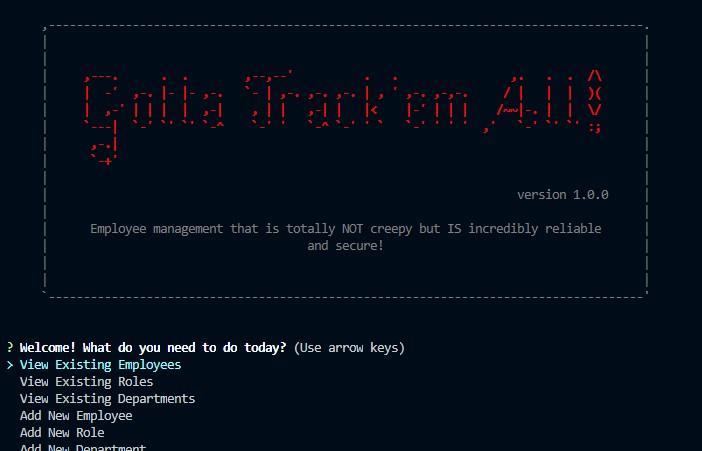

# Team Tracker

## Table of Contents
  * [Description](#description)
  * [Usage](#usage)
  * [Technology](#technology)
  * [Installation](#installation)
  * [License](#license)
  * [Images / Demo Video](#images-/-demo-video)
  * [Contributing to This Repo](#contributing-to-this-repo)
  * [Questions / Contact Details](#questions-/-contact-details)

---

  ## Description
Developers are often tasked with creating interfaces that make it easy for non-developers to view and interact with information stored in databases. This Pokemon themed team tracker handles the managment of team members and associate data using node, inquirer, and MySQL.

---

  ## Usage
CLI content management solution for managing a company's employees using node, inquirer, and MySQL. Since this it Pokemon themed, the three tables used in the database are Gym (which contains the City Gyms trainers are from and equates to a "departments" table), Types (which contains the Trainer or Pokemon's "Type" and Strength information, it equates to a "roles" table), and Members (which contains the names of the Trainers and Pokemon, along with additional information relevant to each "member", it uses references from the Gym & Types tables and equates to the "employees" table).

---

  ## Technology
This app utilizes the following technologies:
 - [npm](https://www.npmjs.com/)
 - [NodeJS](https://nodejs.org/)

---

  ## Installation
Simply use npm i to install. Node app.js is the command to run.

---

  ## License
The applications are covered under a MIT license.

---

  ## Images / Demo Video
  A video demonstration of this application can be found [here](https://youtu.be/xMOKVi3SfCU).
  Click the image to launch the video.

  

---

  ## Contributing to This Repo
  Please Contact me.

---

  ## Questions / Contact Details
  This app can be found on my Github page at [TreeGee73](https://github.com/TreeGee73).

  If you have any questions or need to contact me about this app, I can reached either on Github or by email at [treegee73@gmail.com](treegee73@gmail.com).
